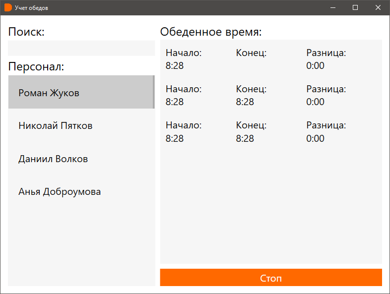
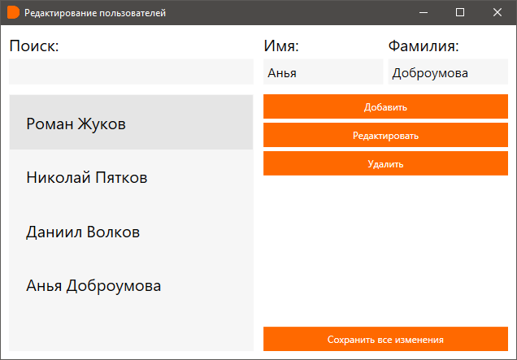

# DodoTimer

## Описание

Программа была создана по просьбе моего знакомого, который работает в Додо, для того, чтобы контролировать обеденное время сотрудника.

## Главное окно 

## Окно для редактирования списка сотрудников

## Стек

- SimpleInjector
- EntityFramework ( Sqlite )
- Mvvm-Dialogs
- NHotkey
- Behaviors.WPF
